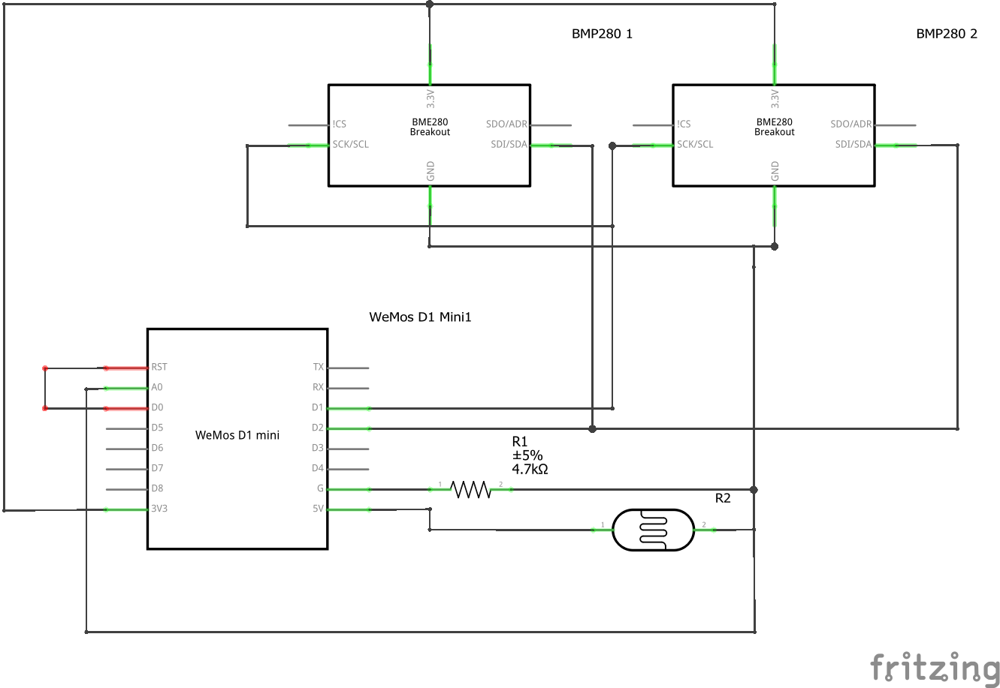

# About
This programm is used to measure the temperature, humidity, pressure and lightlevel of a room and send the data to a firebase realtime database. It supports up to two bmp280 sensors and one light sensor. 

# Scematic


# Credentials
To use the programm create a file called "credentials.h" in the same folder as the main file. The file should contain the following lines:
```c++
const char* ssid = "SSID";
const char* password = "WIFI_PASSWORD";
const char* FIREBASE_URL = "FIREBASE_URL";
const char* FIREBASE_AUTH = "FIREBASE_AUTH"; //API Key
const char* FIREBASE_EMAIL = "account email"; //email of an authentificated user
const char* FIREBASE_PASS = "account password"; //password of an authentificated user
const String ROOM_NAME = "ROOM_NAME";  //Used to identifie the sensor in the database
const String ROOM_NAME2 = "ROOM_NAME2"; //Used to identifie the sensor in the database (if you have more than one sensor connected)
```

# Multiple Sensors
You can use two bmp280 sensors at the same time. To do so, you have to connect the second sensor to the I2C bus of the first sensor, change the address of the second sensor (propably by jumping a solder bridge) and set the "useTwoSensors" var to true.

If the address of the second sensor is not 0x77 you have to change the address in the code.
